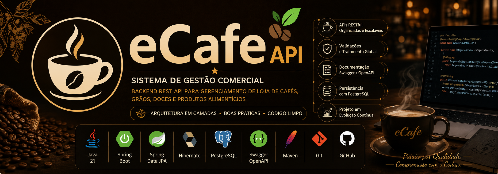

<p align="center">



</p>

<h1 align="center">
☕ eCafe API
</h1>

<p align="center">

Backend REST API desenvolvida com <strong>Java</strong> e <strong>Spring Boot</strong> para um <strong>Sistema de Gestão Comercial</strong> voltado para uma loja especializada na comercialização de cafés, grãos, doces, amendoins, paçocas, rapaduras e outros produtos alimentícios.

Projeto desenvolvido com foco em arquitetura em camadas, boas práticas, escalabilidade e tecnologias amplamente utilizadas no mercado.

</p>

<p align="center">


</p>

---

# 💡 Sobre o Projeto

O **eCafe API** é um projeto pessoal desenvolvido para simular o backend de um sistema de gestão comercial para uma loja especializada na venda de cafés, grãos, doces, amendoins, paçocas, rapaduras e diversos produtos alimentícios.

O objetivo do projeto é consolidar conhecimentos em desenvolvimento backend utilizando Java e Spring Boot, aplicando conceitos presentes em aplicações reais.

Durante o desenvolvimento são aplicadas boas práticas como:

- Arquitetura em Camadas
- APIs REST
- Spring Data JPA
- Hibernate
- Bean Validation
- Tratamento Global de Exceções
- Logs Estruturados
- Documentação com Swagger/OpenAPI
- Versionamento com Git
- Código Limpo

O projeto continuará evoluindo com novas funcionalidades para representar um sistema comercial completo.

---

# 🚀 Tecnologias

<p align="center">


</p>

## Backend

- Java 21
- Spring Boot
- Spring Data JPA
- Hibernate
- Bean Validation

## Banco de Dados

- PostgreSQL

## Documentação

- Swagger
- OpenAPI

## Ferramentas

- IntelliJ IDEA
- Maven
- Git
- GitHub
- Postman

## Em aprendizado

- Docker
- Spring Security
- JWT
- Keycloak
- Redis
- JUnit 5
- Mockito
- Testcontainers
- GitHub Actions

---

# ✅ Funcionalidades Implementadas

## 📂 Categorias

- ✅ Cadastro
- ✅ Listagem
- ✅ Busca por ID
- ✅ Atualização
- ✅ Exclusão

---

## 📦 Produtos

- ✅ Cadastro
- ✅ Listagem
- ✅ Busca por ID
- ✅ Busca por Categoria
- ✅ Atualização
- ✅ Exclusão

---

## 👤 Clientes

- ✅ Cadastro
- ✅ Listagem
- ✅ Busca por ID
- ✅ Atualização
- ✅ Exclusão

---

## 🔧 Recursos Gerais

- ✅ Bean Validation
- ✅ Tratamento Global de Exceções
- ✅ Logs Estruturados
- ✅ Swagger / OpenAPI
- ✅ Spring Data JPA
- ✅ Persistência com PostgreSQL

---

# 🏗 Arquitetura

O projeto segue o padrão **Layered Architecture**, promovendo organização, reutilização, baixo acoplamento e separação de responsabilidades.

```
Cliente

    │

    ▼

REST Controller

    │

    ▼

Service

    │

    ▼

Repository

    │

    ▼

PostgreSQL
```

---

## Organização das Camadas

- Controller
- Service
- Repository
- Entity
- DTO
- Exception
- Config
- Constants

---

# 📂 Estrutura do Projeto

```text
src
└── main
    ├── java
    │   └── eCafe.API
    │       ├── category
    │       ├── common
    │       ├── config
    │       ├── customers
    │       ├── monitoring
    │       ├── product
    │       ├── security
    │       └── EcafeApiApplication.java
    └── resources
```

---

# 📚 Documentação da API

Após iniciar a aplicação, acesse:

```
http://localhost:8080/swagger-ui/index.html
```

---

# ⚙️ Como Executar

## Pré-requisitos

- Java 21
- Maven
- PostgreSQL
- Git

### Clonar o projeto

```bash
git clone https://github.com/adenilson-silva-dev3561/ecafe-api.git
```

### Entrar na pasta

```bash
cd ecafe-api
```

### Executar

Linux

```bash
./mvnw spring-boot:run
```

Windows

```bash
mvnw.cmd spring-boot:run
```

---

# 🗺 Roadmap

## ✅ Fase 1 — Categorias

- [x] CRUD
- [x] Bean Validation
- [x] Logs
- [x] Swagger

---

## ✅ Fase 2 — Produtos

- [x] CRUD
- [x] Busca por Categoria
- [x] Relacionamento Produto x Categoria

---

## ✅ Fase 3 — Clientes

- [x] CRUD
- [x] Validação de CPF
- [x] Validação de E-mail

---

## 🚧 Fase 4 — Carrinho

- [ ] Criar Carrinho
- [ ] Adicionar Produtos
- [ ] Atualizar Quantidade
- [ ] Remover Produtos

---

## 🚧 Fase 5 — Pedidos

- [ ] Criar Pedido
- [ ] Histórico de Pedidos
- [ ] Status do Pedido

---

## 🚧 Fase 6 — Controle de Estoque

- [ ] Entrada de Produtos
- [ ] Saída Automática
- [ ] Inventário

---

## 🚧 Fase 7 — Pagamentos

- [ ] PIX
- [ ] Cartão
- [ ] Dinheiro

---

## 🚧 Fase 8 — NFC-e

- [ ] Emissão de NFC-e
- [ ] XML
- [ ] PDF

---

## 🚧 Fase 9 — Dashboard Administrativo

- [ ] Relatórios
- [ ] Indicadores
- [ ] Produtos mais vendidos

---

## 🚧 Fase 10 — Segurança

- [ ] Spring Security
- [ ] JWT
- [ ] Keycloak
- [ ] Controle de Permissões

---

## 🚧 Infraestrutura

- [ ] Docker
- [ ] Docker Compose
- [ ] Redis
- [ ] JUnit 5
- [ ] Mockito
- [ ] Testcontainers
- [ ] GitHub Actions (CI/CD)

---

# 🎯 Objetivos

Este projeto foi criado para consolidar conhecimentos em:

- Desenvolvimento Backend
- Java
- Spring Boot
- Spring Data JPA
- Hibernate
- PostgreSQL
- APIs REST
- Arquitetura em Camadas
- Bean Validation
- Código Limpo
- Tratamento Global de Exceções
- Logs Estruturados
- Swagger/OpenAPI
- Spring Security
- Docker
- Keycloak
- Testes Automatizados
- CI/CD

---

# 👨‍💻 Autor

## Adenilson Silva

Desenvolvedor Backend Java

<p align="center">

<a href="mailto:adenilson.silva.dev.3561@gmail.com">

</a>

<a href="https://www.linkedin.com/in/adenilson-silva-88702125a/">

</a>

<a href="https://github.com/adenilson-silva-dev3561">

</a>

<a href="https://wa.me/5533998592960">

</a>

</p>

---

<p align="center">

⭐ Se este projeto foi útil para você, deixe uma estrela no repositório.

</p>
